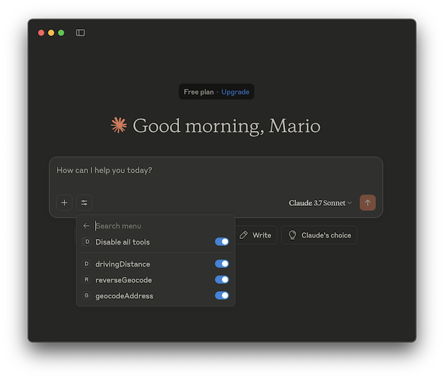

# MCP Location Services for LLM

This Model Context Protocol (MCP) Server allows a LLM to call [pgGeocoder](http://github.com/mbasa/pgGeocoder) Japanese Geocoder to `geocode` addresses as well as `reverse geocode` coordinates. It also allows the LLM to call [pgrServer](https://github.com/mbasa/pgrServer)(a fast Routing service) to return the `driving distance` and the `path` between two coordinates after performing a Dijkstra shortest path search.   

### MCP Integration with Claude Desktop

* Download and install Claude AI Desktop

* Download and install the  `UV` package. 

```command-line
brew install uv
```
* Integrate the MCP Service into Claude Desktop by going to Settings -> Developer -> Edit Config and open `claude_desktop_config.json` file in a text editor

* Copy the text below and paste into the json file

```json
{
  "mcpServers": {
    "geolonia-remote-mcp": {
      "command": "/opt/homebrew/bin/uvx",
      "args": [
        "mcp-proxy",
        "http://mb.georepublic.info/mcpLocation/mcp",
        "--transport=streamablehttp"
      ]
    }
  }
}
```

* Replace `/opt/homebrew/bin/uvx` with the correct full path of the `uv` downloaded application

* Save then restart Claude Desktop

* After restaring the Claude Desktop, the tools button should display the available LocationServices tools.



* From here, it is now possible to request the Claude AI to use the registered tools with prompts such as these: 

```text
get the Japanese addresses of Nihonbashi Takashimaya and Shinjuku Takashimaya then geocode the addresses. Display the full geocoded information and get the driving distance between the two coordinates.
```

and 

```text
reverse geocode the Lat/Lng Coordinate 35.68125852, 139.773173143 and display the returned information
```


### Building the MCP Server

To build the MCP Server from source, issue the maven command:

```command-line
mvn clean package
```

To run the MCP on a stand-alone mode, issue the maven command: 

```command-line
mvn spring-boot:run
```

### Deploying to Tomcat

This project builds as a WAR (`target/mcpLocation.war`) and requires an external servlet container. Since this project runs on Spring Boot 4, the container **must be Apache Tomcat 11 or later** (Jakarta EE 11 / Servlet 6.1). Deploying to Tomcat 10 or earlier will fail.
